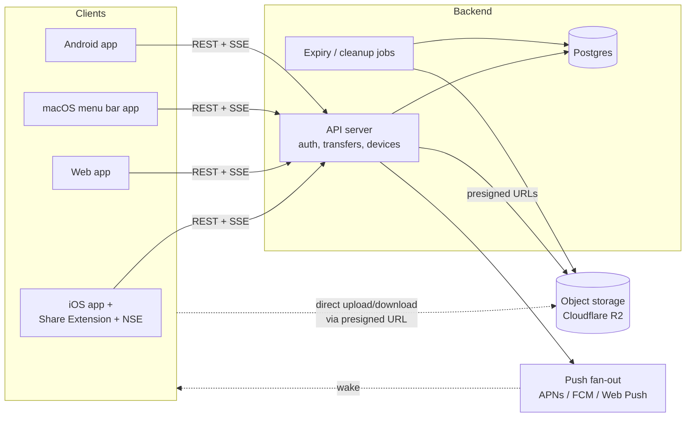
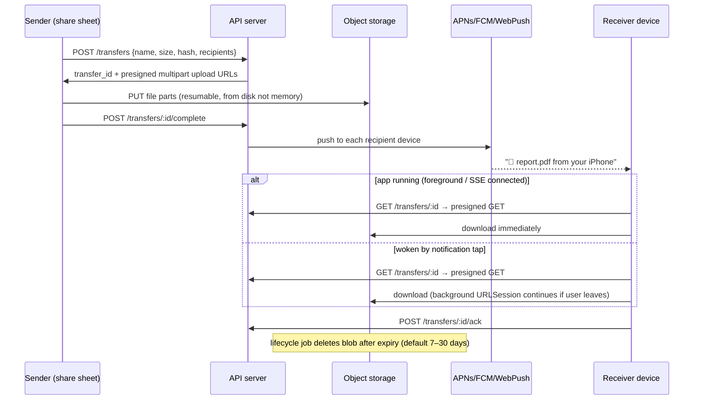

# Transmat Architecture

**Status:** v0 draft — brainstorm/decision doc, nothing is locked in.
**Thesis:** *Email-to-self, minus email.* Async, store-and-forward file transfer with AirDrop's sending ergonomics and a doorbell on the receiving end.

---

## 1. Product principles

These drive every technical choice below:

1. **Async is the point.** The receiving device may be off, asleep, or on another continent. Store-and-forward via a relay is the core mechanic — P2P/LAN is a later optimization, not the foundation.
2. **Targets are devices and people, not folders.** "Send to my MacBook" / "Send to Sam" — never "put it in the synced directory."
3. **Arrival is an event.** The receiver gets a notification the moment a file is available; ideally the file is already there when they look.
4. **The relay is untrusted by design.** Files expire by default, and the architecture must leave a clean path to end-to-end encryption so the server can eventually hold only ciphertext.
5. **Keep the archive.** Searchable transfer history on every device — the one thing email does well that AirDrop doesn't.

## 2. System overview



Two load-bearing decisions in this picture:

- **Clients talk to blob storage directly** with short-lived presigned URLs. File bytes never pass through the API server, so the API stays tiny and cheap no matter how big transfers get.
- **Push wakes the receiver; it doesn't carry the file.** The notification says "report.pdf is waiting"; bytes come down over HTTPS from storage. This keeps us honest about platform push limits (see §6).

### The core transfer flow



## 3. Stack options, weighed

### 3a. Mobile client — the biggest decision

The critical insight that reframes this choice: **the hard iOS parts are native no matter what you pick.** The Share Extension and Notification Service Extension are separate OS-spawned processes that run Swift; React Native/Flutter only own the main app UI. So "native vs cross-platform" is really about the *shell* (settings, history list, contacts, onboarding), which is the easy 60% of the app.

| Option | Pros | Cons |
|---|---|---|
| **Native SwiftUI (iOS only, Android later = rewrite)** | Best extension integration, no bridge weirdness, smallest binary, you learn the platform that owns your constraints | Android becomes a second codebase; slower if you want both soon |
| **React Native via Expo (one codebase)** | `transmat-mobile` becomes iOS+Android; [expo-share-extension](https://github.com/MaxAst/expo-share-extension) and [expo-notification-service-extension-plugin](https://github.com/nikwebr/expo-notification-service-extension-plugin) exist; Expo Push Service abstracts APNs/FCM; huge ecosystem | Extensions still end up as Swift you maintain inside config plugins; EAS build pipeline to learn; occasional fights with the abstraction (e.g. font-scaling bugs in share extension views) |
| **Flutter / Kotlin Multiplatform** | Solid tech | Weaker story for iOS extensions than either option above; smaller relevant plugin ecosystem for this exact app shape |

**Recommendation: Expo + React Native, with the two iOS extensions written as small native Swift targets from day one.** It matches "iOS and Android together (eventually)," and the parts Expo is bad at are parts you'd write in Swift anyway. Counter-recommendation if it applies: if you *want* to learn Swift deeply and are happy shipping Android in a year+, pure SwiftUI is the nicer artifact — this is a taste call, not a correctness call. Either way, budget for the extensions to be real native code you test on a physical device.

### 3b. Web client

Web is the universal escape hatch (borrowed laptop, Linux friend, no-install receive links) plus the account dashboard.

| Option | Notes |
|---|---|
| **Vite + React SPA** ✅ | The API is separate anyway; a SPA keeps `transmat-web` simple. Add Web Push for receive notifications. |
| Next.js | Worth it if you want the marketing site + app + receive-link pages server-rendered in one place. Fine choice, mild extra machinery. |
| Plain HTML receive pages | Regardless of framework: the "someone sent you a file" link must be a dumb, fast page that works logged out. |

Same-language bonus: React on web + React Native on mobile means shared TypeScript types for the API client, transfer states, and (later) crypto envelope format.

### 3c. Desktop

The desktop deliverable is a **menu bar / tray presence**, not a windowed app: a toast when a file arrives, a drop target to send, drag a received file straight out of the popover. (True drag-out-of-*notification* doesn't exist on macOS; drag-out-of-menu-bar-popover does, and feels just as good.)

| Option | Pros | Cons |
|---|---|---|
| **Native Swift menu bar app (macOS first)** ✅ | You're Apple-centric; tiny, instant, native drag & drop and notifications; can share Swift crypto/model code with the iOS extensions | macOS only — Windows/Linux need something else later |
| Tauri v2 | One codebase → Mac/Windows/Linux; small binaries; tray + notifications supported | Webview drag-out and tray UX are serviceable, not delightful; Rust layer to maintain |
| Electron | Most mature APIs, easiest hiring/help | 150MB+ resident for a tray utility; feels wrong for this product's "lightweight" positioning |

**Recommendation:** native Swift menu bar app for macOS in phase 2; revisit Tauri when Windows demand is real. Until then, Windows/Linux users are served by the web app + Web Push.

### 3d. Backend API

| Option | Pros | Cons |
|---|---|---|
| **Node/TypeScript (Hono or Fastify) on Fly.io/Railway** ✅ | Boring, debuggable, one language across the whole project; long-lived process makes SSE/WebSockets and cron trivial | You run a server (a small one) |
| Cloudflare Workers + R2 + D1/Queues | Beautiful co-location with R2, scales to zero, cheap | Platform lock-in; Durable Objects needed for realtime; local dev and debugging are a different world |
| Go | Great fit for a relay server, single static binary | Second language in the project for marginal gain at this scale |
| Supabase as the whole backend | Auth+Postgres+storage out of the box | Push fan-out, presigned multipart, expiry logic end up in edge functions anyway; storage egress pricing worse than R2 |

**Recommendation:** one small TypeScript API server (Hono — it can migrate to Workers later almost unchanged, keeping that door open), Postgres, deployed on Fly.io or Railway. Optimize for "one person can hold the whole backend in their head."

### 3e. Blob storage

| Option | Storage | Egress | Notes |
|---|---|---|---|
| **Cloudflare R2** ✅ | $0.015/GB-mo | **$0** | Zero egress is decisive for a file-transfer app — downloads are the product. S3-compatible API, presigned multipart works, lifecycle rules for expiry. |
| AWS S3 | $0.023/GB-mo | ~$0.09/GB | Egress would dominate costs and scale with success. No. |
| Backblaze B2 | $0.006/GB-mo | free ×3 storage | Legit budget alternative; smaller ecosystem. |

Napkin math: 1,000 active users × 2GB in flight average = 2TB = **~$30/month** on R2, egress included. The cost model works.

Mechanics: presigned **multipart** uploads (resumable, chunk-sized for extension memory limits), presigned GETs with short TTLs, content-hash keys (`blobs/{sha256}`) for free dedupe of the send-to-3-devices case, lifecycle cleanup driven by a DB-scanning job rather than pure R2 lifecycle rules (the DB is the source of truth on who still needs a blob).

### 3f. Database

**Postgres** (Neon or Supabase-managed, or Fly Postgres). The data model (§7) is small and relational; nothing here needs anything exotic. SQLite+Litestream would honestly also work at MVP scale — take Postgres anyway so auth libraries, hosting, and future full-text search on transfer history all have first-class paths.

### 3g. Push & realtime

Three delivery lanes, in priority order per recipient device:

1. **Live connection** (app foregrounded): SSE from the API server. Instant, no platform budget consumed. SSE over WebSockets because it's one-directional anyway and survives proxies/reconnects with less code.
2. **Platform push** (app backgrounded/killed): APNs (iOS/macOS), FCM (Android), Web Push/VAPID (web + desktop browsers). If the client is Expo, **Expo Push Service** wraps APNs+FCM for one API — worth it; the Mac menu bar app talks APNs directly.
3. **Nothing worked**: the transfer is still waiting server-side; it surfaces on next app open. Async means never losing a file to a missed push.

Skip OneSignal/Knock — this app's push payloads are its core product, not marketing; keep them first-party.

### 3h. Auth & identity

- **Account:** email + one-time code (magic code beats magic link on mobile — no app-switch dance), plus **Sign in with Apple** (required by App Review once any third-party login exists, and the lowest-friction option for your iOS-first audience). Passkeys as a fast-follow upgrade path.
- **Device identity is a first-class object,** not just a session: each install registers `{device_id, platform, name ("Kirby's iPhone"), push_token, public_key}`. This is what makes "send to my MacBook" a thing you can point at — and the `public_key` field, present from day one, is the hook E2EE hangs off later (§8).
- **Contacts:** mutual-consent edges between accounts (request → accept). Files from non-contacts require explicit accept before download; files from contacts and your own devices can auto-download within size limits.

## 4. Sending UX by platform

| Platform | Entry point | Mechanism |
|---|---|---|
| iOS | Share sheet on any file/photo/URL | **Share Extension** (§6) |
| macOS | Menu bar drop target, share menu, Finder quick action | Menu bar app + share extension |
| Web | Drag & drop, paste, file picker | SPA upload |
| Android | System share sheet | `ACTION_SEND` intent — the easy one |
| CLI (cheap, high leverage) | `transmat send report.pdf --to laptop` | Talks to the same API; also becomes your API test harness |

Picker rules everywhere: most recent target first, one tap for "the device I always send to," multi-select allowed.

## 5. Receiving UX by platform

| Platform | Arrival experience |
|---|---|
| iOS | Notification with filename + thumbnail; small files pre-fetched when possible; tap → saved in Transmat, visible in the Files app under "On My iPhone → Transmat"; share/export from there. Details and caveats in §6. |
| macOS | Toast from menu bar app; file auto-saved to `~/Transmat` (or Downloads); drag out of the popover onto any app |
| Web | Web Push notification → click → browser download; receive-link page for logged-out recipients |
| Android | Notification; auto-download to `Downloads/Transmat` via foreground service — Android permits what iOS forbids |

## 6. The annoying part: iOS, hashed out 😁

iOS is both your primary platform and the most constrained one. This section is the honest version. The one-line summary: **sending can be made genuinely great; receiving is great when the app is open, good when tapped, and physically cannot be "silent auto-download of anything, always" — so we design the product language around "tap to beam down" instead of pretending.**

### 6a. Sending via Share Extension — solvable, with rules

A Share Extension is a separate, short-lived, memory-capped process. The pattern that works:

1. User shares a file → extension UI appears (keep it tiny: target picker + send button, nothing else).
2. Extension **copies the file to the shared App Group container on disk** — never into memory. Extensions get on the order of ~100MB of RAM; a 4K video is bigger than that. All reads/uploads are file-based or streamed ([Apple's guidance](https://developer.apple.com/forums/thread/675079) is explicit: upload tasks in extensions must be from-file).
3. Extension creates the transfer record via the API, then enqueues the upload on a **background `URLSession`** with `sharedContainerIdentifier` set. The upload is executed by the system daemon (`nsurlsessiond`), so it **continues after the extension is dismissed** — the user shares, taps send, and walks away. The main app is woken on completion to finalize.
4. Failure honesty: background-session-from-extension has documented flakiness ([XPC errors on repeat shares since iOS 15](https://github.com/tumblr/ios-extension-issues/issues/1) reported by Tumblr and others). Mitigations: fresh session identifier per share, a "finish in app" fallback deep-link for very large files, and testing on physical devices from week one — extensions barely work in the simulator.

Also sendable from the extension: URLs and clipboard text (Pushbullet's most-loved feature — for free, since they're small enough to send through the API directly).

### 6b. Receiving — the honest matrix

The notification itself is never the problem: an **alert push arrives reliably and instantly** even with the app killed. The question is only *when the bytes move*. Four cases:

| State | What happens | Mechanism |
|---|---|---|
| **App in foreground** | File downloads instantly, in-app banner, done | SSE event → immediate download |
| **Backgrounded/killed, small file** (≲10MB) | Notification *with thumbnail*; file is already fetched by the time it's tapped | **Notification Service Extension**: gets ~30s and ~24MB to mutate the push — enough to pull a small file/preview into the App Group container ([limits: ~10MB image / ~50MB video attachments](https://bugfender.com/blog/advanced-ios-push-notifications/), and NSE memory is the real ceiling) |
| **Backgrounded/killed, large file** | Notification arrives instantly: *"report.mov (1.2GB) — tap to receive."* Tap starts a background `URLSession` download that survives leaving the app; a **Live Activity** shows progress on the lock screen | This is the case to embrace, not apologize for — one tap, and the "beam down" progress bar becomes brand personality |
| **Opportunistic prefetch** | Sometimes files are just already there | `content-available` silent push — but APNs budgets these to roughly [a handful per device per day](https://support.pushy.me/hc/en-us/articles/360043925371-How-can-I-send-silent-background-notifications-on-iOS) and drops them freely (Low Power Mode, user behavior). **Treat as a bonus lane, never the delivery mechanism.** Same for `BGAppRefreshTask`: use it to sync history/prefetch on the OS's schedule, promise nothing |

Design consequence: auto-accept policy on iOS is really "auto-*prefetch* within NSE limits, one-tap beyond them." Android and desktop get true auto-download; the product copy should never promise iOS something the OS forbids.

### 6c. Where files live on iOS

- The app's Documents directory, exposed in the **Files app** via `UIFileSharingEnabled` + `LSSupportsOpeningDocumentsInPlace` → "On My iPhone → Transmat". Zero extension code, users can browse/move/share everything. **This is the MVP answer.**
- A **File Provider extension** (Transmat as a top-level location in Files, files streaming on demand) is the deluxe version — but File Provider extensions run under a [20MB memory limit](https://developer.apple.com/forums/thread/804378) and their own lifecycle rules. Phase 3+, if ever.
- Photos/videos additionally offer "Save to Photos" via the Photos framework (permission-gated).

### 6d. The rest of the iOS tax (know it now, don't discover it)

- **Apple Developer Program** ($99/yr) needed for push, App Groups, extensions, TestFlight.
- **App Review:** account deletion required in-app; export-compliance declaration for encryption (standard exemption for HTTPS/standard crypto — a checkbox, but declare it); no undocumented background tricks (audio-session hacks etc. get rejected — don't).
- **Extension debugging** is its own skill: attach-to-process in Xcode, physical device, lots of `os_log`.
- **Sequencing bet:** build the share extension + push receive spike *first*, before any app chrome — it's the highest-risk 20% and it validates the whole product feel (§10, Phase 0).

## 7. Data model sketch

```sql
users        (id, email, apple_sub, created_at)
devices      (id, user_id, platform,            -- ios|android|macos|web|cli
              name,                              -- "Kirby's iPhone"
              push_token, push_channel,          -- apns|fcm|webpush|expo
              public_key,                        -- E2EE hook, nullable in v1
              last_seen_at)
contacts     (user_id, contact_user_id, status)  -- pending|accepted|blocked
blobs        (sha256 PK, size, ref_count, expires_at)
transfers    (id, sender_user_id, sender_device_id,
              blob_sha256 FK, file_name, mime_type,
              kind,                              -- file|text|url
              created_at, expires_at)
recipients   (transfer_id, target_kind,          -- device|user
              target_id, state,                  -- pending|notified|downloaded|expired
              acked_at)
```

Notes: `blobs` separate from `transfers` gives content-hash dedupe and correct cleanup (`ref_count` → delete from R2 when no live transfer needs it). `recipients.target_kind` cleanly encodes "to my MacBook" (device) vs "to Sam" (user → fan out to all their devices at notify time). Text/URL pushes reuse the whole pipeline with inline payloads instead of blobs.

## 8. Security & encryption roadmap

**v1 — honest baseline:** TLS everywhere; R2 server-side encryption at rest; presigned URLs short-lived (minutes) and single-use where possible; default expiry 7 days (max 30) so the steady state is "the server holds little." Say exactly this in the privacy copy — no E2EE theater.

**v2 — real E2EE** (the marquee feature, and the answer to "why not just Discord DMs"):
- Per-device X25519 keypair, generated on-device, private key in Secure Enclave/Keystore (the `devices.public_key` column has been waiting for this).
- Per-file: random AES-256-GCM key; file encrypted **in chunks** (extension memory limits again — streaming crypto, never whole-file); file key wrapped for each recipient device's public key.
- New-device enrollment via QR handshake with an existing device (Signal's model, simplified: no forward-secrecy ratchet needed for store-and-forward files).
- Server sees: ciphertext blobs, wrapped keys, metadata. Consider whether filenames encrypt too (notification then says "A file from Kirby" — real privacy/UX tradeoff to decide then).

**Abuse & safety (matters once contacts exist):** accept-before-download from non-contacts, always; per-user rate/size/storage quotas; virus-scan hook (e.g. ClamAV job) on relay files below size cap — moot once E2EE, which is also the honest position (you can't scan what you can't see, and the DMCA story is "we hold expiring ciphertext"); report/block flows.

## 9. Cross-cutting concerns checklist

- **Resumability:** multipart chunks on upload, HTTP Range on download; transfer states idempotent, clients retry safely.
- **Observability:** delivery-funnel metrics per lane (created → uploaded → pushed → downloaded → acked) — this funnel *is* the product health metric; Sentry on all clients.
- **Cost guardrails:** per-user storage quota, max file size (start 2GB), alert on egress-op anomalies.
- **Offline sender:** queue the send locally, upload when back online — the share sheet should never fail because of a tunnel.
- **Naming:** note Google's unrelated [`transmat` drag-and-drop web library](https://github.com/google/transmat) exists; fine for a project name, check trademark before a paid launch.

## 10. Build order

**Phase 0 — kill the risk (1–2 weekends).** No app chrome. iPhone share extension → App Group → background upload to R2 → API → APNs push → second device (or web) taps → downloads. If this demo feels magical, everything else is decoration. Hardcode two devices; skip auth.

**Phase 1 — MVP: iOS + web.** Auth (email code + SIWA), device registry, real picker in the extension, NSE thumbnails, Files-app inbox, web upload/receive + Web Push, expiry jobs, transfer history. Ship to TestFlight, live on it yourself — the "do I still email myself?" test is the only KPI.

**Phase 2 — macOS menu bar app + CLI.** Drop target, toast + drag-out, auto-save folder. This is when it replaces email-to-self *completely* for you.

**Phase 3 — Android + contacts.** Expo makes Android mostly config + one foreground service; send-to-people with accept flows.

**Phase 4 — E2EE, then P2P fast path** (LAN/WebRTC direct when both ends are online, relay as fallback — LocalSend-speed when possible, Transmat reliability always).

## 11. Open questions

1. Expo+native-extensions vs pure SwiftUI — decided by appetite: Android soon (Expo) vs deepest Apple polish (Swift)?
2. Default retention: 7 vs 30 days? (Cost is minor; the question is product identity — inbox or archive?)
3. Is "permanent storage" a paid tier (BYO S3/Drive) or explicitly out of scope forever?
4. Self-hostable relay: open-source the server for the LocalSend crowd (adoption wedge, support burden) or keep closed?
5. Encrypt filenames under E2EE, or trade that metadata for better notifications?
6. Free-tier limits that keep abuse boring: max file size / total quota / expiry?

---

*Next step when we start building: Phase 0 spike — `transmat-mobile` gets the share-extension experiment, `transmat-web` gets the API + a bare receive page.*
