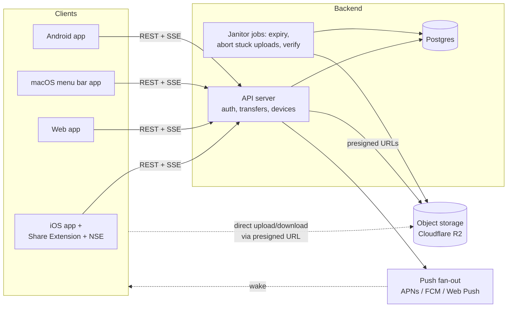

# Transmat Architecture

**Status:** v0.2 draft — brainstorm/decision doc, nothing is locked in.
**Reviewed:** v0.1 went through an adversarial review pass (Apple-platform claims, infra/security/cost, internal coherence) on 2026-08-18; this revision folds in all confirmed findings. Changes are marked inline where the correction is instructive.
**Thesis:** *Email-to-self, minus email.* Async, store-and-forward file transfer with AirDrop's sending ergonomics and a doorbell on the receiving end.

---

## 1. Product principles

These drive every technical choice below:

1. **Async is the point.** The receiving device may be off, asleep, or on another continent. Store-and-forward via a relay is the core mechanic — P2P/LAN is a later optimization, not the foundation.
2. **Targets are devices and people, not folders.** "Send to my MacBook" / "Send to Sam" — never "put it in the synced directory."
3. **Arrival is an event.** The receiver gets a notification the moment a file is available; ideally the file is already there when they look. (This entire principle is gated on the user granting notification permission — see §6e.)
4. **The relay is untrusted by design.** Files expire by default, and the architecture must leave a clean path to end-to-end encryption so the server can eventually hold only ciphertext.
5. **Keep the archive.** Searchable transfer history on every device — the one thing email does well that AirDrop doesn't. (History metadata persists even after file bytes expire.)

## 2. System overview



Two load-bearing decisions in this picture:

- **Clients talk to blob storage directly** with short-lived presigned URLs. File bytes never pass through the API server, so the API stays tiny and cheap no matter how big transfers get. The cost of this choice: the server must *verify after the fact* what actually landed in storage (§3e), because it never saw the bytes.
- **Push wakes the receiver; it doesn't carry the file.** The notification says "report.pdf is waiting"; bytes come down over HTTPS from storage. This keeps us honest about platform push limits (see §6).

### The core transfer flow

```mermaid
sequenceDiagram
    participant S as Sender (share sheet)
    participant API as API server
    participant R2 as Object storage
    participant P as APNs/FCM/WebPush
    participant D as Receiver device

    S->>API: POST /transfers {name, size, recipients}
    API->>S: transfer_id + presigned multipart part URLs<br/>(content-length signed per part)
    S->>R2: PUT file parts (fixed part size, resumable)
    S->>API: POST /transfers/:id/complete
    API->>R2: HeadObject — record actual stored size,<br/>enforce quota/max-size on it
    API->>P: push to each recipient's devices
    P-->>D: "📄 report.pdf from your iPhone"
    alt app running (foreground / SSE connected)
        D->>API: GET /transfers/:id → fresh presigned GET
        D->>R2: download immediately
    else woken by notification tap
        D->>API: GET /transfers/:id → fresh presigned GET
        D->>R2: download (background URLSession continues if user leaves)
    end
    D->>API: POST /deliveries/:id/ack
    Note over R2: janitor deletes blob when no live<br/>recipient needs it; aborts stuck multiparts
```

Transfers have an explicit lifecycle: `uploading → complete → (cancelled | revoked | expired)`. Sender can cancel while uploading and **revoke** after sending (`DELETE /transfers/:id` — decrements blob refs, pushes a retraction so receiving devices clear the notification). Clients re-request fresh part URLs on every resume; part URLs are scoped to one upload-id and are idempotent to re-issue.

## 3. Stack options, weighed

### 3a. Mobile client — the biggest decision

The critical insight that reframes this choice: **the hard iOS parts are native no matter what you pick.** The Share Extension and Notification Service Extension are separate OS-spawned processes; React Native/Flutter only own the main app UI. So "native vs cross-platform" is really about the *shell* (settings, history list, contacts, onboarding), which is the easy 60% of the app.

| Option | Pros | Cons |
|---|---|---|
| **Native SwiftUI (iOS only, Android later = rewrite)** | Best extension integration, no bridge weirdness, smallest binary, you learn the platform that owns your constraints | Android becomes a second codebase; slower if you want both soon |
| **React Native via Expo (one codebase)** | `transmat-mobile` becomes iOS+Android; Expo Push Service abstracts APNs/FCM; huge ecosystem; Expo push payloads support `mutableContent` and `categoryId`, so NSE-mutated notifications and action categories are sendable through it | Extensions require a **custom config plugin** wrapping hand-written native targets (see below); EAS build pipeline to learn; occasional fights with the abstraction (e.g. a live SDK-54 bug where `content-available` pushes fail in bridgeless mode) |
| **Flutter / Kotlin Multiplatform** | Solid tech | Weaker story for iOS extensions than either option above; smaller relevant plugin ecosystem for this exact app shape |

⚠️ *Review correction:* v0.1 name-dropped [expo-share-extension](https://github.com/MaxAst/expo-share-extension) and [expo-notification-service-extension-plugin](https://github.com/nikwebr/expo-notification-service-extension-plugin) as evidence the Expo path is paved. They exist, but they implement a **different architecture** than ours: expo-share-extension runs a React Native view *inside* the share extension (an RN runtime eats a big slice of the extension's ~120MB memory budget, and it documents nothing about background-URLSession handoff), and the NSE plugin expects an Objective-C file. Our plan — small hand-written native Swift extension targets — means writing our own config plugin that adds those targets at prebuild. Doable and documented by Expo, but it's work we own, not a plugin we install. Also: Expo Push does **not** support the APNs `liveactivity` push type — anything ActivityKit-push-driven needs a direct APNs lane (token-based auth) alongside Expo Push.

**Recommendation: Expo + React Native, with the two iOS extensions as hand-written native Swift targets added via our own config plugin.** It matches "iOS and Android together (eventually)," and the parts Expo is bad at are parts we'd write in Swift anyway. Counter-recommendation if it applies: if you *want* to learn Swift deeply and are happy shipping Android in a year+, pure SwiftUI is the nicer artifact — this is a taste call, not a correctness call. Either way, budget for the extensions to be real native code tested on a physical device.

### 3b. Web client

Web is the universal escape hatch (borrowed laptop, Linux friend, no-install receive links) plus the account dashboard.

| Option | Notes |
|---|---|
| **Vite + React SPA** ✅ | The API is separate anyway; a SPA keeps `transmat-web` simple. |
| Next.js | Worth it if you want the marketing site + app + receive-link pages server-rendered in one place. Fine choice, mild extra machinery. |
| Plain HTML receive pages | Regardless of framework: the "someone sent you a file" link must be a dumb, fast page that works logged out. Links are a first-class recipient type with their own token, expiry, and revocation — see §3i. |

Same-language bonus: React on web + React Native on mobile means shared TypeScript types for the API client, transfer states, and (later) crypto envelope format.

**Web receive reality check** (⚠️ corrected from v0.1, which oversold Web Push): on iOS, Web Push only works for web apps **added to the Home Screen** — a Safari-tab visitor can never get a push. Desktop Web Push needs an explicit permission grant and a running browser. So the web story is honestly: SSE while the tab is open, "it's waiting for you on next visit" otherwise, with Web Push as an upgrade for installed-PWA/desktop users who grant it.

### 3c. Desktop

The desktop deliverable is a **menu bar / tray presence**, not a windowed app — the Transfer Hub (§5a) pops from the menu bar. (True drag-out-of-*notification* doesn't exist on macOS; drag-out-of-menu-bar-popover does, and feels just as good.)

| Option | Pros | Cons |
|---|---|---|
| **Native Swift menu bar app (macOS first)** ✅ | You're Apple-centric; tiny, instant, native drag & drop and notifications (`NSStatusItem` + popover, `LSUIElement` so no Dock icon); can share Swift crypto/model code with the iOS extensions | macOS only — Windows/Linux need something else later |
| Tauri v2 | One codebase → Mac/Windows/Linux; small binaries; tray + notifications supported | Webview drag-out and tray UX are serviceable, not delightful; Rust layer to maintain |
| Electron | Most mature APIs, easiest hiring/help | 150MB+ resident for a tray utility; feels wrong for this product's "lightweight" positioning |

**Recommendation:** native Swift menu bar app for macOS in phase 2; revisit Tauri when Windows demand is real. Until then, Windows/Linux users are served by the web app.

Mac push plumbing (from review — know before building): a Developer-ID (non-App-Store) Mac app receives APNs only when signed with a provisioning profile embedding the `com.apple.developer.aps-environment` entitlement, and macOS **won't launch an app for a `content-available` push — only running apps get them**. So "registers as a Login Item via `SMAppService` and is always resident" isn't a nicety, it's a delivery requirement. Notarization + hardened runtime apply.

### 3d. Backend API

| Option | Pros | Cons |
|---|---|---|
| **Node/TypeScript (Hono or Fastify) on Fly.io/Railway** ✅ | Boring, debuggable, one language across the whole project; long-lived process makes SSE and cron trivial | You run a server (a small one) |
| Cloudflare Workers + R2 + D1/Queues | Beautiful co-location with R2, scales to zero, cheap | Platform lock-in; Durable Objects needed for realtime; local dev and debugging are a different world |
| Go | Great fit for a relay server, single static binary | Second language in the project for marginal gain at this scale |
| Supabase as the whole backend | Auth+Postgres+storage out of the box | Push fan-out, presigned multipart, expiry logic end up in edge functions anyway; storage egress pricing worse than R2 |

**Recommendation:** one small TypeScript API server (Hono — it can migrate to Workers later almost unchanged, keeping that door open), Postgres, deployed on Fly.io or Railway. Optimize for "one person can hold the whole backend in their head."

### 3e. Blob storage

| Option | Storage | Egress | Notes |
|---|---|---|---|
| **Cloudflare R2** ✅ | $0.015/GB-mo | **$0** | Zero egress is decisive for a file-transfer app — downloads are the product. S3-compatible API, presigned multipart works, native rule to abort stale multipart uploads. |
| AWS S3 | $0.023/GB-mo | ~$0.09/GB | Egress would dominate costs and scale with success. No. |
| Backblaze B2 | $0.006/GB-mo | free ×3 storage | Legit budget alternative; smaller ecosystem. |

Napkin math, honestly framed (⚠️ v0.1 called the R2 line alone "the cost model"): 1,000 active users × 2GB in flight = 2TB = ~$30/mo on R2 storage, egress $0. Operation charges are real but small (Class A puts at 5MiB parts ≈ $0.90 per TB uploaded; Class B reads ≈ free). The *system* floor also includes managed Postgres (~$20/mo), compute ($5–20/mo), and the $99/yr Apple Developer Program — so think "~$60–90/mo at 1,000 users," which still works. The "2GB average" is an assumption the quotas below must actively enforce, not a fact.

**Mechanics — corrected and hardened by review:**

- **Blobs are keyed by random `blob_id` (UUID), not content hash.** v0.1 proposed `blobs/{sha256}` for cross-user dedupe; the review killed it three ways: (1) the hash is client-declared and the bytes bypass the API, so a malicious client can claim hash H and upload garbage — every later sender of the real file dedupes onto the poisoned blob (R2/S3 cannot enforce whole-object SHA-256 across multipart parts); (2) any "hash already exists, skip upload" shortcut is a file-existence oracle and, worse, upload-by-hash (the Dropbox "Dropship" incident); (3) under v2 E2EE, identical plaintexts produce unique ciphertexts, so content addressing dies anyway. `sha256` survives as a nullable, *server-verified* integrity column. The send-to-3-devices case never needed content addressing — it's one blob referenced by three recipient rows.
- **Presigned URLs are reusable bearer tokens for their whole TTL — "single-use" is not a thing in S3-compatible storage.** Mitigations: single-digit-minute TTLs, part URLs scoped to one upload-id, GET URLs issued only to an authorized, live recipient at request time, and awareness that a leaked URL is usable until expiry.
- **Size enforcement:** sign `content-length` into each part URL, cap the number of part URLs at ⌈declared_size / part_size⌉, and on `/complete` verify with `HeadObject` — quotas, the max-file limit (start 2GB), and billing guards all run on the *actual* stored size, and blobs that exceed declared size get deleted.
- **Multipart rules:** R2 requires all parts except the last to be the **same size, ≥ 5MiB** — pick one fixed part size up front (5–8MiB also fits extension memory limits) and keep it for the life of the upload.
- **Abandoned uploads:** an R2 lifecycle rule aborts incomplete multipart uploads after ~3 days (they bill as storage until aborted!), and the janitor also aborts the stored upload-id of any transfer stuck in `uploading` past a deadline.
- **Blob lifetime is derived, never independently authoritative:** delete from R2 when no live recipient row references the blob (i.e. at max of referencing recipients' expiries — see §8 retention). Ref transitions take row locks, and deletion goes through a `deleting` tombstone state so a concurrent attach can't race a delete.

### 3f. Database

**Postgres** (Neon or Supabase-managed, or Fly Postgres). The data model (§7) is small and relational. SQLite+Litestream would honestly also work at MVP scale — take Postgres anyway so auth libraries, hosting, and search all have first-class paths. Search note from review: filename search should use `pg_trgm` GIN indexes (Postgres FTS tokenizes `IMG_4032.HEIC`-style names poorly), plus composite indexes for the Hub's filters.

### 3g. Push & realtime

Three delivery lanes, in priority order per recipient device:

1. **Live connection** (app foregrounded): SSE from the API server. Instant, no platform budget consumed. SSE over WebSockets because it's one-directional anyway and survives proxies/reconnects with less code.
2. **Platform push** (app backgrounded/killed): APNs (iOS/macOS), FCM (Android), Web Push/VAPID (installed PWA / desktop browsers — see §3b caveats). If the client is Expo, **Expo Push Service** wraps APNs+FCM — but note it covers *only* those two: Web Push is its own VAPID pipeline, and Live Activity pushes need direct APNs, so we run a small multi-channel abstraction regardless.
3. **Nothing worked**: the transfer is still waiting server-side; it surfaces on next app open / next sync. Async means never losing a file to a missed push. This lane is also how devices with no push channel at all receive: the **CLI** (polls/SSE while running, lane 3 otherwise) and pruned web browsers.

Skip OneSignal/Knock — this app's push payloads are its core product, not marketing; keep them first-party.

### 3h. Auth & identity

- **Account:** email + one-time code, plus **Sign in with Apple** as a convenience. ⚠️ *Review correction:* v0.1 claimed SIWA is required by App Review when other logins exist. Guideline 4.8 was rewritten in January 2024: it now only triggers for **third-party/social** login services and no longer mandates SIWA specifically. Our email-code auth is first-party, so 4.8 imposes nothing — SIWA stays purely because it's the lowest-friction path for an Apple-first audience. Passkeys as a fast-follow.
- **OTP hardening** (missing from v0.1): ≥6 random digits, single active code, 10-minute expiry, 5–10 attempt cap then invalidate, per-email and per-IP rate limits, constant-time compare, resend throttling. Account takeover here means every stored file *and* every paired device — treat login as a security surface, not a form.
- **Sessions are real objects:** a `sessions` table (per-device, revocable, listed in settings, killed on logout). "Device identity is first-class" doesn't replace sessions; it pairs with them.
- **Device identity:** each install registers `{device_id, platform, name ("Kirby's iPhone"), push_channel, push_token, public_key}`. `push_token` is nullable (CLI has none) and has a lifecycle: refreshed on every app launch, cleared on APNs `Unregistered`/FCM `UNREGISTERED` feedback, and **nulled on logout/unlink** so ex-devices stop receiving "report.pdf from Sam." `last_seen_at` updates on any authenticated call — it drives picker ordering ("most recent target first") and auto-pruning of stale web-browser device rows. Each browser profile is its own named device ("Chrome on MacBook").
- **Contacts:** mutual-consent edges between accounts (request → accept), with an `auto_accept` flag per edge per direction — that's the setting the Transfer Hub toggles. Files from non-contact *accounts* always require explicit accept before download; contacts and your own devices can auto-download within per-device size limits (`device_settings`).

### 3i. Receive links (logged-out recipients)

v0.1 mentioned these in passing; review flagged them as the biggest unspecified abuse surface, so they're now specified: a link is a **first-class recipient** (`recipients.target_kind = link`) with its own row in `links`: random high-entropy token, its own expiry (≤ the transfer's), a `max_downloads` count, and sender revocation. The public page exchanges token → fresh short-TTL presigned GET **server-side** (the R2 URL never appears in the shareable link). Creating a link is always an explicit sender act — the "accept-before-download from non-contacts" rule applies to accounts; a link *is* the sender's explicit consent to public egress, bounded by expiry, download count, and revocation.

## 4. Sending UX by platform

| Platform | Entry point | Mechanism |
|---|---|---|
| iOS | Share sheet on any file/photo/URL | **Share Extension** (§6) |
| macOS | Menu bar drop target, share menu, Finder quick action | Menu bar app + share extension |
| Web | Drag & drop, paste, file picker | SPA upload |
| Android | System share sheet | `ACTION_SEND` intent — the easy one |
| CLI (cheap, high leverage) | `transmat send report.pdf --to laptop` | Talks to the same API; also becomes your API test harness |

Picker rules everywhere: most recent target first (`last_seen_at`), one tap for "the device I always send to," multi-select allowed.

**Offline sending** (⚠️ reworked — v0.1's "create record first, then upload" flow failed exactly when the share sheet is used in a tunnel): the share extension *always* writes `{file copy, targets}` to an App Group **outbox** and returns success immediately. Transfer-record creation and part-URL issuance happen at upload time — by the extension when online, otherwise by the main app / `BGProcessingTask` / next foreground. Clients re-request fresh part URLs on every resume, since presigned URLs will have expired. The share sheet never fails for lack of connectivity.

## 5. Receiving UX by platform

| Platform | Arrival experience |
|---|---|
| iOS | Notification with filename + thumbnail; small files pre-fetched when possible; tap → saved in Transmat, visible in the Files app under "On My iPhone → Transmat"; share/export from there. Details and caveats in §6. |
| macOS | Transfer Hub popover opens from the menu bar (§5a); file auto-saved to `~/Transmat` (or Downloads); drag out of the popover onto any app |
| Web | Library page on next visit; Web Push where available (installed PWA / desktop with permission) → click → browser download; receive-link page for logged-out recipients (§3i) |
| Android | Notification; auto-download to `Downloads/Transmat` via foreground service — Android permits what iOS forbids |

### 5a. The Transfer Hub

The receiving surface isn't just a toast — it's a small, always-reachable window that is both the arrival prompt and the archive. One UI, two modes:

**Arrival mode** (desktop: pops from the menu bar when a transfer lands, or just badges — user-configurable so it can respect Focus/Do Not Disturb):
- Sender + origin device, filename, size, thumbnail preview
- **Accept / Decline** (auto-accept from your own devices and contacts with `auto_accept` set; the Hub is where you flip it)
- **Retention control per file**: "expires in 7 days ▾" stepper right on the card — extend to 30 days, shorten, or *Keep* (pin: downloaded + retained locally on this device; the relay copy still expires on schedule — §8)
- Drag the file straight out of the card onto any app or folder

**Library mode** (same window, scrolled/expanded — also the main screen of the mobile app):
- Search across full transfer history (filename via `pg_trgm`, sender, type)
- Filters: by device ("everything I sent to the MacBook"), by contact, by direction, by kind (file/text/url), by status (expiring soon)
- Re-send any past item to a new target in two clicks
- Pin/favorite items you keep reaching for (`pins` table — synced metadata, per-device local copies)

Platform reality check for the Hub:
- **macOS:** exactly this — `NSStatusItem` + popover/panel. This is why §3c prefers a native menu bar app: instant open, native drag-out, no Dock icon.
- **iOS:** apps cannot pop windows over other apps, so *arrival mode* maps to the richest thing iOS allows: a notification with **action buttons** (Accept / Keep 30 days / Decline) via `UNNotificationCategory`. Honesty notes from review: action buttons only appear on **long-press/pull-down** (a plain tap opens the app — most users need to discover the gesture, so the app should teach it once); a background "Accept" action gets seconds of execution, enough to *enqueue* a background download, never to perform it; and completion feedback is a local notification, since no live progress UI can accompany a background-initiated download (§6b). *Library mode* is simply the app's home screen: same search, filters, retention editing.
- **Android:** heads-up notification with the same action buttons; library mode identical to iOS.
- **Web:** the SPA's home page is library mode; arrival mode is a Web Push notification where available (§3b) — keep it a click-through.

Backend implications, so the Hub isn't a mockup the API can't serve: server-side search + filter params on the list endpoints from day one; **retention is per-recipient and mutable** (`PATCH /recipients/:id {expires_at}`, bounded to the 30-day max, logged to `retention_events` so "who extended this?" is answerable); Accept/Decline are real recipient states with defined cleanup semantics (§7).

## 6. The annoying part: iOS, hashed out 😁

iOS is both your primary platform and the most constrained one. This section is the honest version. The one-line summary: **sending can be made genuinely great; receiving is great when the app is open, good when tapped, and physically cannot be "silent auto-download of anything, always" — so we design the product language around "tap to beam down" instead of pretending.**

### 6a. Sending via Share Extension — solvable, with rules

A Share Extension is a separate, short-lived, memory-capped process. The pattern that works:

1. User shares a file → extension UI appears (keep it tiny: target picker + send button, nothing else).
2. Extension **copies the file to the shared App Group container on disk** (the outbox, §4) — never into memory. Extensions get ~120MB of RAM; a 4K video is bigger than that. All reads/uploads are file-based or streamed ([Apple's guidance](https://developer.apple.com/forums/thread/675079) is explicit: upload tasks in extensions must be from-file).
3. Extension enqueues the upload on a **background `URLSession`** with `sharedContainerIdentifier` set. The upload is executed by the system daemon (`nsurlsessiond`), so it **continues after the extension is dismissed** — the user shares, taps send, and walks away. The main app is woken on completion to finalize (`/complete`, staging-file cleanup).
4. Risk honesty, recalibrated by review: the [historical Tumblr-reported bug](https://github.com/tumblr/ios-extension-issues/issues/1) hit exactly this pattern (background upload tasks failing to read App Group files) — but it's iOS-15-era, closed, and marked "has workaround / possibly fixed." Treat it as **a specific thing Phase 0 must re-verify on current iOS**, not a present-tense blocker. If it ever resurfaces, the fallbacks are known: keep the extension on-screen with a progress bar until the upload finishes (Tumblr's workaround — the degraded UX we're trying to avoid), or a "finish in app" deep-link for very large files.
5. Simulator honesty (corrected): extensions *run* fine in the simulator — what the simulator doesn't do is enforce extension memory caps or faithfully reproduce `nsurlsessiond` hand-off, i.e. exactly the two things this design depends on. Physical-device testing from week one is mandatory for those reasons, not because extensions "barely work."

Also sendable from the extension: URLs and clipboard text (Pushbullet's most-loved feature — for free, since they ride the API as inline payloads, §7).

### 6b. Receiving — the honest matrix

The notification itself is never the problem: an **alert push arrives reliably and instantly** even with the app killed — *if* notification permission was granted (§6e). The question is only *when the bytes move*. The cases:

| State | What happens | Mechanism |
|---|---|---|
| **App in foreground** | File downloads instantly, in-app banner, done | SSE event → immediate download |
| **Backgrounded/killed, small file** (≲10MB) | Notification *with thumbnail*; file is already fetched by the time it's tapped | **Notification Service Extension**: ~30s and ~24MB to mutate the push — enough to pull a small file/preview into the App Group container (attachment caps: ~10MB image / 50MB video / 5MB audio; NSE memory is the real ceiling) |
| **Backgrounded/killed, large file** | Notification arrives instantly: *"report.mov (1.2GB) — tap to receive."* Tap (or long-press → Accept) starts a background `URLSession` download that survives leaving the app; completion announced by a local notification | This is the case to embrace, not apologize for |
| **Force-quit** (user swiped the app away — power users do this habitually) | Alert pushes and NSE still work; **silent pushes are never delivered and `BGAppRefreshTask` stops being scheduled** — the prefetch lane is dead until the next manual app launch | Named here so nobody debugs it as a bug later |
| **Opportunistic prefetch** | Sometimes files are just already there | `content-available` silent push. ⚠️ Corrected numbers: Apple's own guidance is a dynamic budget of roughly **2–3 per hour** (not "a handful per day" as v0.1 said), but delivery is discretionary — throttled, dropped in Low Power Mode, force-quit kills it entirely. The conclusion stands: **a bonus lane, never the delivery mechanism.** Same for `BGAppRefreshTask`: OS-scheduled sync/prefetch, promise nothing |

**Live Activities, corrected** — v0.1 promised "a Live Activity shows progress on the lock screen" during a background download. The review established this **cannot work as described**: a backgrounded app gets no `URLSession` progress callbacks (it's only woken at completion), so there's no code running to update the Activity; and ActivityKit's push-update path doesn't help because the server can't see a client↔R2 download's progress. What we *can* honestly ship: a Live Activity with an **estimated** timer (`ProgressView(timerInterval:)`) started when the user taps (foreground), updated at completion — or real byte-progress only while the app is foregrounded. Background-action-initiated downloads can't start a Live Activity at all (push-to-start requires direct APNs `liveactivity` pushes, which also bypasses Expo Push). Design the "beam down" moment around determinate progress *in the app* and an honest indeterminate glow on the lock screen.

Design consequence: auto-accept policy on iOS is really "auto-*prefetch* within NSE limits, one-tap beyond them." Android and desktop get true auto-download; the product copy should never promise iOS something the OS forbids.

### 6c. Where files live on iOS

- The app's Documents directory, exposed in the **Files app** via `UIFileSharingEnabled` + `LSSupportsOpeningDocumentsInPlace` → "On My iPhone → Transmat". Zero extension code, users can browse/move/share everything. **This is the MVP answer.**
- Backup hygiene (from review): expiring transfer blobs must be flagged `isExcludedFromBackup` (or live in Caches) so users don't back up gigabytes of ephemeral files to iCloud; *pinned* ("Keep") files are the ones that belong in backed-up Documents. And the App Group staging area that the share extension and NSE both write into needs an explicit cleanup pass (on app launch + after upload/download completion) — nothing deletes those copies by default.
- A **File Provider extension** (Transmat as a top-level location in Files, files streaming on demand) is the deluxe version — but File Provider extensions run under a [20MB memory limit](https://developer.apple.com/forums/thread/804378) (confirmed live, Apple DTS acknowledged). Phase 3+, if ever.
- Photos/videos additionally offer "Save to Photos" via the Photos framework (permission-gated).

### 6d. The rest of the iOS tax (know it now, don't discover it)

- **Apple Developer Program** ($99/yr) needed for push, App Groups, extensions, TestFlight.
- **App Review:** account deletion required in-app (5.1.1(v)); export compliance is a checkbox **for v1** (HTTPS/standard crypto → exempt) but ⚠️ **not for v2 E2EE** — custom application of encryption typically means annual US self-classification reporting and a French (ANSSI) declaration for App Store distribution in France. Not blockers; calendar items.
- **Extension debugging** is its own skill: attach-to-process in Xcode, physical device, lots of `os_log`.
- **Sequencing bet:** build the share extension + push receive spike *first*, before any app chrome — it's the highest-risk 20% and it validates the whole product feel (§10, Phase 0).

### 6e. Notification permission gates the thesis

"Arrival is an event" (§1) assumes the user granted notification permission — a one-shot system prompt that users routinely deny, after which there is **no doorbell at all** (SSE-when-open only). Consequences: the permission ask gets a pre-permission explainer screen at onboarding ("Transmat is a doorbell; without notifications it's a mailbox you have to check"); **provisional authorization is not a substitute** (it delivers silently to Notification Center — explicitly not a doorbell); Live Activities carry their own user toggle. Denied-permission state should be visible in the app ("notifications off — files will wait silently") rather than a mystery.

## 7. Data model sketch

Reworked in v0.2 — the review found v0.1's model couldn't express Accept/Decline, per-recipient retention, per-device delivery, links, pins, text payloads, or sessions. Now it can:

```sql
users            (id, email, apple_sub, created_at)
sessions         (id, user_id, device_id, refresh_token_hash, created_at, revoked_at)
devices          (id, user_id, platform,          -- ios|android|macos|web|cli
                  name,                            -- "Kirby's iPhone", "Chrome on MacBook"
                  push_channel,                    -- apns|fcm|webpush|expo|none
                  push_token,                      -- nullable; cleared on logout & platform feedback
                  public_key,                      -- E2EE hook, nullable in v1
                  last_seen_at)                    -- any authed call; drives picker sort + pruning
device_settings  (device_id PK, auto_download_max_bytes, arrival_popover, ...)
contacts         (user_id, contact_user_id, status,   -- pending|accepted|blocked
                  auto_accept)                     -- per-edge, per-direction; the Hub's toggle

blobs            (id uuid PK,                      -- random key; NOT content-addressed (§3e)
                  r2_key, size_declared, size_actual,
                  sha256,                          -- server-verified integrity, nullable
                  state,                           -- uploading|verified|deleting
                  created_at)
transfers        (id, sender_user_id, sender_device_id,
                  state,                           -- uploading|complete|cancelled|revoked|expired
                  kind,                            -- file|text|url
                  blob_id FK nullable,
                  inline_payload text nullable,    -- text/url, ≤64KB; CHECK: exactly one of the two
                  file_name, mime_type, created_at)
recipients       (id, transfer_id, target_kind,    -- device|user|link
                  target_id nullable,              -- null for link
                  state,                           -- pending|accepted|declined|expired
                  expires_at,                      -- per-recipient retention (default 7d, max 30d)
                  decided_at)
deliveries       (id, recipient_id, device_id,     -- per-device fan-out state
                  state,                           -- notified|downloaded|failed
                  acked_at)
links            (token PK, recipient_id, expires_at, max_downloads, download_count, revoked_at)
pins             (user_id, transfer_id, device_id nullable, created_at)  -- "Keep"
retention_events (id, recipient_id, actor_user_id, old_expires_at, new_expires_at, at)
```

Semantics the review forced into the open:

- **Fan-out:** `recipients` records addressing *intent* (a device, a user, a link); `deliveries` is materialized per concrete device at notify time **and lazily when a user registers a new device or syncs** — so a device added after the send still sees the (unexpired) transfer, honoring §3g lane 3. A user-recipient counts as `downloaded` when any of their deliveries is; other devices' notifications are cleared on first download (configurable later).
- **Decline** is terminal per-recipient: releases that recipient's claim on the blob, notifies the sender with per-recipient state; re-sends allowed unless blocked.
- **Blob lifetime** = derived from live recipient rows (max `expires_at` over non-declined, non-expired recipients of transfers referencing it). No independent blob expiry column to drift out of sync. Deletes go through the `deleting` tombstone under row locks (§3e).
- **Text/URL transfers** (`kind ≠ file`) have no blob leg at all: payload delivered inline in `GET /transfers/:id`, no NSE prefetch needed (it fits in the push or one API call), nothing in the Files app, and the *row persists in history* after "expiry" — expiry only ever deletes bytes, never the archive (§1 principle 5). Inline payloads are clipboard contents — the E2EE-sensitive stuff — so they're first in line for v2 encryption and are covered by retention like everything else.
- **Search/filters:** `pg_trgm` GIN on `file_name`, composite indexes on `recipients(target_id, state)`, `transfers(sender_device_id, created_at)`, partial index for expiring-soon.

## 8. Security & encryption roadmap

**Retention (decided — was open question 2):** default **7 days**, receiver- or sender-extendable per recipient to a max of **30**, server-enforced. *Keep/pin* means the local copy persists on that device; the relay copy always expires on schedule. Server-side permanence beyond 30 days is out of scope unless it becomes a paid BYO-storage tier (still open, §11).

**v1 — honest baseline:** TLS everywhere; R2 server-side encryption at rest; presigned URLs short-TTL bearer tokens issued per-request to authorized recipients (§3e — no single-use pretense); OTP + session hardening (§3h); per-user quotas enforced on verified sizes. Say exactly this in the privacy copy — no E2EE theater. **And because v1 holds plaintext: a registered DMCA agent and a takedown flow exist from the first day of public availability** — the "expiring ciphertext" defense only exists after v2.

**v2 — real E2EE** (the marquee feature, and the answer to "why not just Discord DMs"):
- Per-device X25519 keypair, generated on-device, private key in Secure Enclave/Keystore (the `devices.public_key` column has been waiting for this).
- Per-file: **don't hand-roll chunked AES-GCM** (v0.1's sketch permitted chunk reordering/truncation/splicing attacks). Use a named streaming-AEAD construction: libsodium `crypto_secretstream` (XChaCha20-Poly1305, counter nonces, final-chunk tag) or the age format's STREAM payload (64KiB chunks, last-chunk bit). Chunked so extension memory limits hold.
- The file key is wrapped for each recipient device's public key; the manifest (filename, size, chunk count, recipients) is bound as associated data; and the envelope carries a **sender signature** — raw ECIES-style wrapping would let anyone who knows your public key forge "a file from Kirby."
- New-device enrollment via QR handshake with an existing device (Signal's model, simplified — no ratchet needed for store-and-forward). Explicit trade-off to decide: old transfers were wrapped for the old device set, so a new device can't read history unless an existing device **re-wraps** file keys for it (background job on the granting device) — or we accept "new devices see new files only."
- Server sees: ciphertext blobs, wrapped keys, metadata. Cross-user dedupe is *deliberately sacrificed* (already removed from v1's design, §3e — no convergent-encryption temptation). Open: encrypt filenames too, and notifications say "A file from Kirby"? Real privacy/UX tradeoff.
- Export compliance changes at this point (§6d).

**Abuse & safety:** accept-before-download from non-contact accounts, always (links are sender-explicit, §3i); OTP and API rate limits; per-user storage/bandwidth quotas on verified sizes; content moderation stated honestly — hash blocklists and report/block flows, plus ClamAV for known-bad signatures on relay files (a checkbox against commodity malware, not a control — and none of it survives E2EE, which is the honest position to document); sender revocation (§2) as the user-facing kill switch.

## 9. Cross-cutting concerns checklist

- **Resumability:** fixed-size multipart parts on upload with re-issuable part URLs (§3e, §4); HTTP Range on download; transfer states idempotent, clients retry safely.
- **Observability:** delivery-funnel metrics per lane (created → uploaded → verified → pushed → delivered → acked) — this funnel *is* the product health metric; prefetch hit rate on iOS; Sentry on all clients.
- **Cost guardrails:** per-user storage quota (verified bytes), max file size (start 2GB), part-URL caps, stuck-upload aborts, alert on op-count anomalies.
- **Staging hygiene:** App Group outbox/inbox cleanup on iOS (§6c); `isExcludedFromBackup` on ephemeral blobs.
- **Naming:** Google's unrelated [`transmat` drag-and-drop web library](https://github.com/google/transmat) exists; fine for a project name, check trademark before a paid launch.

## 10. Build order

**Phase 0 — kill the risk (extended by review).** No app chrome. iPhone share extension → App Group outbox → background upload to R2 → API → APNs push → second device taps → downloads. Hardcode two devices; skip auth. **Exit criteria are receive-side, not just send-side** (the review's sharpest point: the thesis is "arrival is an event," and a happy-path tap test doesn't test it): the NSE prefetch spike works; the rig runs as a **daily driver for two weeks** on a real phone — through Focus modes, Low Power, force-quits, repeat shares (the §6a flakiness re-verification) — while measuring pushed→seen→downloaded latency and prefetch hit rate. If arrival degrades to "a link I tap eventually," the thesis fails *here*, cheaply.

**Phase 1 — MVP: iOS + web.** Auth (email code + SIWA, hardened per §3h), device registry + sessions, real picker in the extension, NSE thumbnails, notification categories (Accept/Decline/Keep), Files-app inbox with backup exclusions, web library + upload, receive links (§3i), retention + revoke + janitor jobs, transfer history with search. DMCA agent registered before public availability. Ship to TestFlight, live on it yourself — the "do I still email myself?" test is the only KPI.

**Phase 2 — macOS menu bar app + CLI.** Login-item resident (§3c), Transfer Hub popover, drop target, drag-out, auto-save folder. This is when it replaces email-to-self *completely* for you.

**Phase 3 — Android + contacts.** Expo makes Android mostly config + one foreground service; send-to-people with accept flows and `auto_accept`.

**Phase 4 — E2EE, then P2P fast path** (LAN/WebRTC direct when both ends are online, relay as fallback — LocalSend-speed when possible, Transmat reliability always).

## 11. Open questions

1. Expo+native-extensions vs pure SwiftUI — decided by appetite: Android soon (Expo) vs deepest Apple polish (Swift)?
2. ~~Default retention 7 vs 30 days~~ **Decided in v0.2:** default 7, max 30 (§8).
3. Server-side permanence beyond 30 days: a paid BYO-storage (your S3/Drive) tier, or explicitly never?
4. Self-hostable relay: open-source the server for the LocalSend crowd (adoption wedge, support burden) or keep closed?
5. E2EE metadata: encrypt filenames (notifications become "A file from Kirby") or keep them visible for better notifications?
6. E2EE history for new devices: re-wrap flow (complexity) or "new devices see new files only" (simplicity)?
7. Free-tier limits that keep abuse boring: max file size / total quota / link download caps?

---

*Next step when we start building: Phase 0 spike — `transmat-mobile` gets the share-extension experiment, `transmat-web` gets the API + a bare receive page.*
