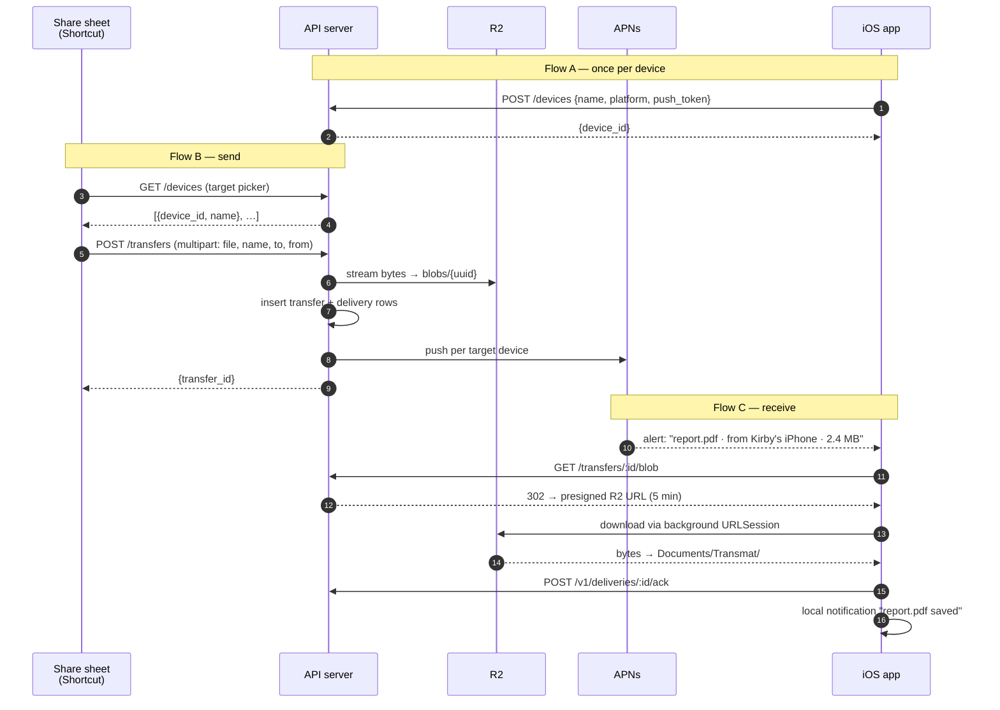

# Weekend 0 — end-to-end flow

The build spec for the doorbell proof. Scope and rationale live in [ARCHITECTURE.md §10](ARCHITECTURE.md); this is *what actually happens, in order*, so we can build against it.

**The one thing this MVP proves:** a file leaves one device and **arrives as an event** on another — lock screen, one tap, done.

---

## The three flows

### Flow A — one-time setup (per device)

Happens once on first launch. Nothing moves until this is done.

1. App launches, shows a settings screen: **server URL** + **access token** (pasted by hand — no accounts in Weekend 0, and this keeps secrets out of the repo).
2. App asks for notification permission. If denied, the whole product is a mailbox — surface that state plainly rather than silently.
3. On grant: `registerForRemoteNotifications()` → iOS calls back with a device token (`Data` → hex string).
4. App `POST /devices` with `{name, platform, push_token}`. Server upserts on `push_token` and returns a `device_id`.
5. App displays its own `device_id` in settings, so it can be pasted into the Shortcut.

### Flow B — sending

Two senders in Weekend 0, both hitting the same endpoint.

**From the iPhone (the ergonomic test):** share sheet → Transmat Shortcut → optional target picker → `POST /transfers` (multipart) → done. The sheet stays open during upload; "share and walk away" is Weekend 1.

**From the laptop:** `curl -F file=@report.pdf …` — same endpoint, no UI.

### Flow C — receiving (the part that matters)

Push lands → tap (or long-press → **Accept**) → download → file on the phone, visible in the Files app.

---

## The whole thing as one sequence



---

## API surface

> ⚠️ **Superseded — this is the Weekend 0 surface.** [`CONTRACT.md`](CONTRACT.md) is authoritative and covers the presigned upload path, SSE, revoke and the blob route. Two details below were also wrong as written: `POST /devices` returns a full `Device`, not `{device_id}`, and `POST /transfers` returns `{transfer: Transfer}`, not `{transfer_id}`. Every route takes the `/v1` prefix.

Every route takes `Authorization: Bearer <TRANSMAT_TOKEN>`.

| Route | Purpose | Notes |
|---|---|---|
| `POST /devices` | Register / update a device | Upsert on `push_token`. Body: `{name, platform, push_token}` → `{device_id}` |
| `GET /devices` | List targets | Feeds the Shortcut's picker and the app's settings |
| `POST /transfers` | Send a file | `multipart/form-data`: `file`, plus `name`, `to`, `from` fields → `{transfer_id}` |
| `GET /transfers` | Recent transfers | For the app's list view |
| `GET /transfers/:id/blob` | Download | **302 redirect** to a 5-minute presigned R2 GET — `URLSession` follows it automatically |
| `POST /v1/deliveries/:id/ack` | Mark received | Keyed by **delivery_id**, not transfer_id — a transfer can have several deliveries. Closes the funnel: created → pushed → downloaded → acked |

**Targeting.** `to` accepts a `device_id`, or `others` (every registered device except `from`), or `all`. Default `others`. `from` is the sender's `device_id` when known; curl can omit it.

**Why upload streams through the server but download redirects to R2:** the Shortcut can't easily do a two-step presign dance, so upload takes the simple path; download gets the real architecture for free, since a redirect costs nothing and keeps gigabytes off the server. Direct-to-R2 *upload* is Phase 1.

### Data model (SQLite, four tables)

```sql
devices   (id, name, platform, push_token UNIQUE, created_at, last_seen_at)
transfers (id, from_device_id, file_name, mime_type, size, r2_key, created_at)
deliveries(id, transfer_id, device_id, state, pushed_at, acked_at)  -- state: pending|pushed|downloaded
```

Deliveries exist from day one even though Weekend 0 has two devices — it's the table that makes "sent to my laptop *and* my iPad" work later without a migration, and it's what the funnel metrics read.

---

## The push payload

```json
{
  "aps": {
    "alert": {
      "title": "report.pdf",
      "subtitle": "from Kirby's iPhone",
      "body": "2.4 MB · tap to receive"
    },
    "sound": "default",
    "category": "TRANSFER_ARRIVED",
    "mutable-content": 1,
    "thread-id": "transmat"
  },
  "transfer_id": "01J...",
  "file_name": "report.pdf",
  "size": 2516582
}
```

- `category` is what makes long-press show **Accept / Decline**. Registered app-side via `UNNotificationCategory`.
- `mutable-content` does nothing yet — it's the hook the notification service extension uses in Weekend 1 to prefetch and attach a thumbnail. Free to include now.
- Sent with token auth: a `.p8` key, JWT signed ES256, over HTTP/2 to `api.push.apple.com`. JWTs expire after an hour, so cache and refresh.

---

## iOS app — what actually gets written

Five files, roughly.

| File | Does |
|---|---|
| `TransmatApp.swift` | App entry, `UNUserNotificationCenter` delegate, registers the `TRANSFER_ARRIVED` category |
| `Settings.swift` | Server URL + token (Keychain), shows this device's `device_id` |
| `API.swift` | The six calls above |
| `Downloader.swift` | Background `URLSession`, download → `Documents/Transmat/`, ack, local "saved" notification |
| `TransferList.swift` | The list view — what's arrived, what's downloading |

**Three lifecycle callbacks carry the whole receive path:**

- `didRegisterForRemoteNotificationsWithDeviceToken` → hex the token, `POST /devices`
- `userNotificationCenter(_:didReceive:withCompletionHandler:)` → fires on tap *and* on the Accept action. **Enqueue the download only** — this window is seconds, not minutes. Call the completion handler immediately after enqueueing.
- `application(_:handleEventsForBackgroundURLSession:completionHandler:)` → iOS wakes the app when a background download finishes. Easy to forget, and without it completions get lost when the app isn't running.

**Two `Info.plist` keys** put received files in the Files app under *On My iPhone → Transmat*, for free: `UIFileSharingEnabled` and `LSSupportsOpeningDocumentsInPlace`.

---

## The Shortcut

Built in the Shortcuts app, "Show in Share Sheet" enabled, accepting Files/Images/URLs:

1. **Get Contents of URL** — `GET {server}/devices`, Authorization header → list of targets
2. **Choose from List** — pick the target device *(trim this and hardcode `to=others` if it's fiddly)*
3. **Get Contents of URL** — `POST {server}/transfers`, Request Body: **Form**
   - `file` = Shortcut Input
   - `name` = the file's name
   - `to` = chosen `device_id`
   - `from` = this phone's `device_id` (pasted once from the app's settings screen)
4. **Show Notification** — "Sent ✓"

Export it and commit the `.shortcut` file to `transmat-mobile` as documentation.

---

## Deliberately faked or missing

Written down so nobody mistakes a shortcut for a decision:

| Faked in Weekend 0 | Real version |
|---|---|
| One shared bearer token | Email OTP + sessions + per-device identity (§3h) |
| Upload streams through the API | Presigned direct-to-R2 multipart, resumable, server-verified sizes (§3e) |
| Share sheet stays open while uploading | Share extension + background `URLSession` (§6a) |
| No thumbnail, nothing pre-fetched | Notification service extension prefetch (§6b) |
| Files live forever | 7-day expiry, janitor jobs, retention controls (§8) |
| No encryption beyond TLS | Per-file keys, wrapped per device (§8 v2) |
| SQLite, single box | Postgres, deliveries fan-out, search indexes (§7) |

---

## Definition of done

Weekend 0 succeeds when all five hold:

1. `curl` a file from the laptop → **the iPhone's lock screen lights up within ~2 seconds**.
2. Tapping the notification saves the file, and it's visible in the Files app.
3. Long-press → **Accept** downloads it *without opening the app*.
4. Sharing a file from any iOS app reaches the server through the Shortcut.
5. The phone survives being sent forty things in a row without the list breaking.

Then the actual test begins: **two weeks of daily-driver use.** Does the doorbell change how it feels versus checking an inbox? That's the thesis — everything above is just the cheapest apparatus for asking the question honestly.

### Optional: close the loop back to the laptop

~30 lines of Node: `transmat watch` polls `GET /transfers`, downloads anything addressed to the laptop's `device_id` into `~/Downloads`, and acks. Register the laptop as a device with `push_channel: none` and it round-trips — phone → laptop *and* laptop → phone — without a Mac app.
